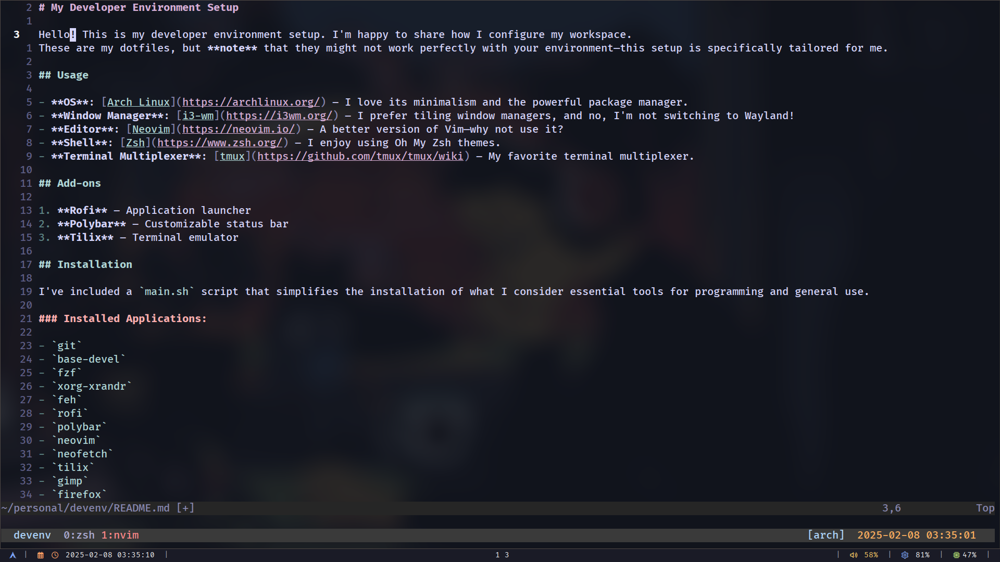
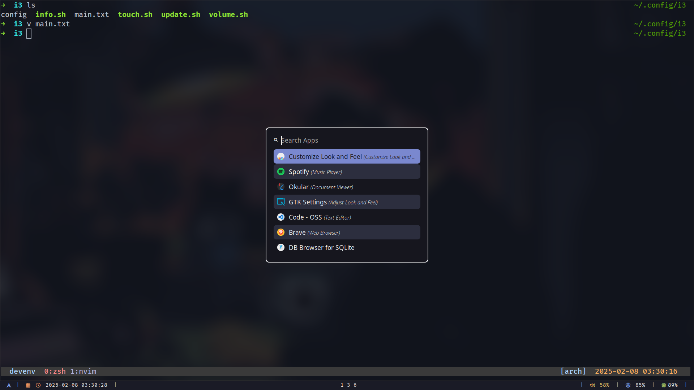

# My Developer Environment Setup

Hello! This is my developer environment setup. I'm happy to share how I configure my workspace.
These are my dotfiles, but **note** that they might not work perfectly with your environment—this setup is specifically tailored for me.

## Usage

- **OS**: [Arch Linux](https://archlinux.org/) – I love its minimalism and the powerful package manager.
- **Window Manager**: [i3-wm](https://i3wm.org/) – I prefer tiling window managers, and no, I'm not switching to Wayland!
- **Editor**: [Neovim](https://neovim.io/) – A better version of Vim—why not use it?
- **Shell**: [Zsh](https://www.zsh.org/) – I enjoy using Oh My Zsh themes.
- **Terminal Multiplexer**: [tmux](https://github.com/tmux/tmux/wiki) – My favorite terminal multiplexer.

## Add-ons

1. **Rofi** – Application launcher
2. **Polybar** – Customizable status bar
3. **Tilix** – Terminal emulator

## Installation

I've included a `main.sh` script that simplifies the installation of what I consider essential tools for programming and general use.

### Installed Applications:

- `git`
- `base-devel`
- `fzf`
- `xorg-xrandr`
- `feh`
- `rofi`
- `polybar`
- `neovim`
- `neofetch`
- `tilix`
- `gimp`
- `firefox`
- `zsh`
- `i3-wm`
- `sddm`
- `ttf-font-awesome` (font)
- `ttf-fira-code` (font)

## Pictures :

